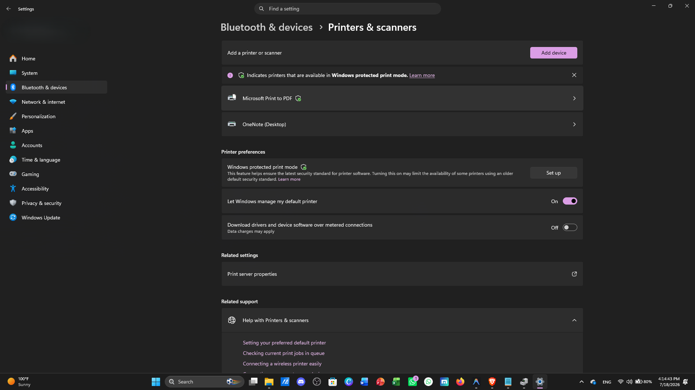

# Printer Troubleshooting

## Overview

Printer issues are among the most common support requests in office environments. This guide provides a structured approach to diagnosing and resolving printer-related problems in Windows.

---

## Symptoms

Users may experience:

- Printer is offline
- Unable to print documents
- Print jobs stuck in queue
- Slow printing
- Poor print quality
- Printer not detected
- Paper jams

---

## Possible Causes

- Printer is powered off
- USB or network connection problem
- Printer is offline
- Print Spooler service stopped
- Outdated printer driver
- Low ink or toner
- Paper jam
- Incorrect default printer

---

## Troubleshooting Methodology

### Step 1 – Check Printer Power

Verify that:

- Printer is powered on
- No error lights are displayed
- Paper is loaded correctly

---

### Step 2 – Check Physical Connection

For USB printers:

- Verify the USB cable is connected securely.

For network printers:

- Verify the printer is connected to the network.
- Ensure the Ethernet cable or WiFi connection is working.

---

### Step 3 – Verify Printer Status

Open:

```
Settings → Bluetooth & Devices → Printers & Scanners
```

Check whether the printer status is:

- Ready
- Offline
- Error

---

## Printer Settings Overview

Windows Printer Settings allow IT Support technicians to manage installed printers, check printer status, configure printing options, and troubleshoot connection issues.



---

### Step 4 – Set as Default Printer

Select the correct printer and choose:

```
Set as Default
```

---

### Step 5 – Clear the Print Queue

Open the printer queue.

Cancel all pending print jobs.

Try printing again.

---

### Step 6 – Restart the Print Spooler

Open Command Prompt as Administrator:

```cmd
net stop spooler
net start spooler
```

---

### Step 7 – Update or Reinstall Printer Driver

Open:

```
Device Manager
```

Locate the printer.

Update or reinstall the driver if necessary.

---

### Step 8 – Print a Test Page

Open:

```
Printer Properties
```

Select:

```
Print Test Page
```

Verify that printing is successful.

---

## Useful Commands

```cmd
net stop spooler
```

Stop the Print Spooler service.

```cmd
net start spooler
```

Start the Print Spooler service.

```cmd
services.msc
```

Open Windows Services.

```cmd
control printers
```

Open the Printers window.

---

## Resolution

Most printer issues can be resolved by:

- Restarting the printer
- Clearing the print queue
- Restarting the Print Spooler
- Updating printer drivers
- Reconnecting the printer
- Setting the correct default printer

---

## Prevention

- Keep printer drivers updated.
- Use genuine ink or toner.
- Clean the printer regularly.
- Monitor paper levels.
- Restart printers periodically.

---

## Related Issues

- Hardware Checklist
- Keyboard & Mouse Issues