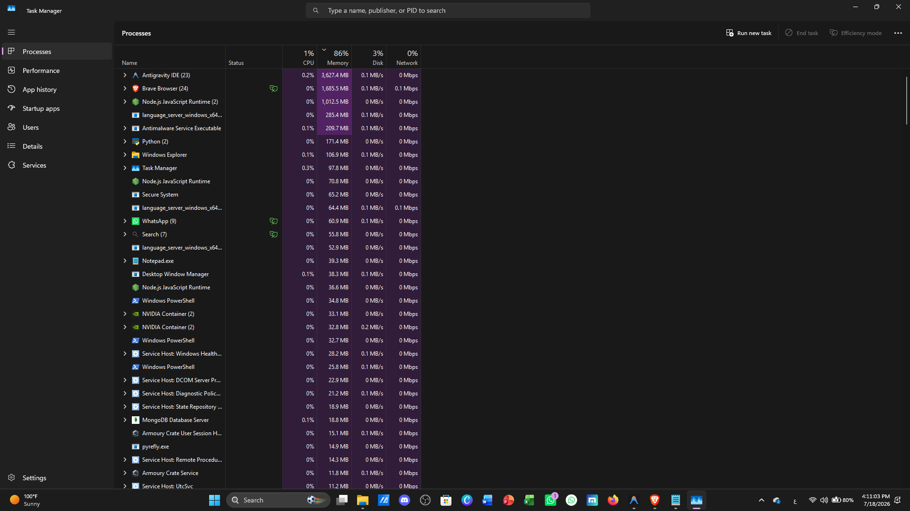
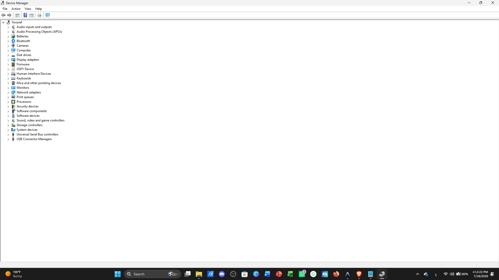
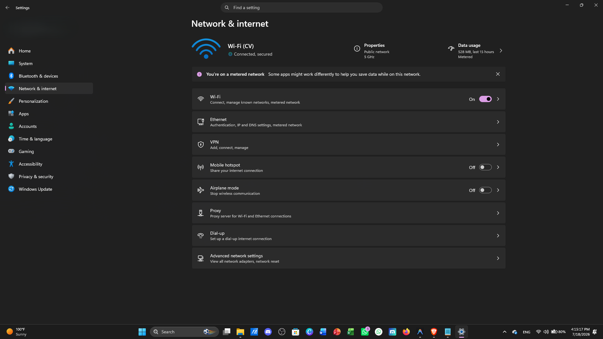

# IT Support Knowledge Base 🖥️


A professional **IT Support Knowledge Base** containing structured troubleshooting guides, technical documentation, command references, and best practices for common Windows, Network, Hardware, Account, and Security issues.

This repository demonstrates practical **IT Support skills, troubleshooting methodology, documentation standards, and Help Desk workflows** used in real-world environments.

---

# 📖 Table of Contents

- [📌 About](#-about)
- [📂 Repository Structure](#-repository-structure)
- [📚 Topics Covered](#-topics-covered)
- [🔍 Troubleshooting Methodology](#-troubleshooting-methodology)
- [⌨️ Command Reference](#️-command-reference)
- [🖼️ Screenshots](#️-screenshots)
- [🛠️ Tools Used](#️-tools-used)
- [💡 Skills Demonstrated](#-skills-demonstrated)
- [🚀 Future Improvements](#-future-improvements)
- [👨‍💻 Author](#-author)
- [⭐ Purpose](#-purpose)

---

# 📌 About

This project was created to showcase professional **IT Support documentation and problem-solving techniques**.

Each troubleshooting guide follows a standardized documentation format to ensure consistency, readability, and easy maintenance.

Every guide includes:

- Overview
- Symptoms
- Possible Causes
- Troubleshooting Steps
- Useful Commands
- Resolution
- Prevention
- Related Issues

The goal is to simulate a real-world **IT Help Desk Knowledge Base** used by support teams.

---

# 📂 Repository Structure

```text
IT-Support-Knowledge-Base/
│
├── Windows-Troubleshooting/
│   ├── slow-computer.md
│   ├── blue-screen-bsod.md
│   ├── startup-problems.md
│   └── windows-update-errors.md
│
├── Network-Issues/
│   ├── wifi-problems.md
│   ├── dns-problems.md
│   ├── ip-configuration.md
│   └── internet-not-working.md
│
├── Hardware-Issues/
│   ├── hardware-checklist.md
│   ├── printer-issues.md
│   └── keyboard-mouse.md
│
├── Account-Support/
│   ├── password-reset.md
│   ├── account-lockout.md
│   └── email-issues.md
│
├── Security/
│   ├── basic-security-checklist.md
│   ├── malware-prevention.md
│   └── password-policy.md
│
├── Commands/
│   ├── windows-commands.md
│   └── networking-commands.md
│
├── Screenshots/
│
├── Templates/
│   └── troubleshooting-template.md
│
├── CHANGELOG.md
├── CODE_OF_CONDUCT.md
├── CONTRIBUTING.md
├── LICENSE
└── README.md
```

---

# 📚 Topics Covered

## 🪟 Windows Troubleshooting

Documentation for common Windows problems:

- Slow Computer
- Blue Screen (BSOD)
- Startup Problems
- Windows Update Errors

---

## 🌐 Network Issues

Network troubleshooting guides covering:

- WiFi Connectivity Problems
- DNS Problems
- IP Configuration Issues
- Internet Connectivity Problems

---

## 🖨️ Hardware Issues

Hardware diagnosis and troubleshooting:

- Printer Issues
- Keyboard & Mouse Problems
- Hardware Troubleshooting Checklist
- Device Manager Diagnostics

---

## 👤 Account Support

Common user account problems:

- Password Reset
- Account Lockout
- Email Issues

---

## 🔒 Security

Basic security documentation:

- Security Checklist
- Malware Prevention
- Password Policy Guidelines

---

# 🔍 Troubleshooting Methodology

All documentation follows a structured troubleshooting workflow:

```
Identify Issue
      ↓
Collect Information
      ↓
Verify Symptoms
      ↓
Analyze Possible Causes
      ↓
Apply Solution
      ↓
Validate Result
      ↓
Document Resolution
```

This approach follows standard IT Help Desk troubleshooting practices.

---

# ⌨️ Command Reference

The repository includes command references for common IT Support tasks.

## Windows Commands

Examples:

```cmd
sfc /scannow
```

Repair corrupted Windows system files.

```cmd
DISM /Online /Cleanup-Image /RestoreHealth
```

Repair Windows image health.

```cmd
chkdsk /f
```

Check and repair disk errors.

---

## Networking Commands

Examples:

```cmd
ipconfig /all
```

Display detailed network configuration.

```cmd
ping
```

Test network connectivity.

```cmd
nslookup
```

Perform DNS lookup.

```cmd
netstat
```

Display active connections.

---

# 🖼️ Screenshots

The documentation includes real troubleshooting screenshots:

## Task Manager



---

## Device Manager



---

## Printer Settings


---

## Windows Update


---

## Network Settings



---

# 🛠️ Tools Used

- GitHub
- Markdown
- Windows 10 / Windows 11
- Command Prompt
- Windows Security
- Device Manager
- Task Manager
- Windows Settings
- Network Diagnostic Tools
- Git Version Control

---

# 💡 Skills Demonstrated

- IT Help Desk Support
- Windows Administration
- Windows Troubleshooting
- Network Troubleshooting
- Hardware Diagnostics
- Account Management
- Security Best Practices
- Technical Documentation
- Knowledge Base Development
- Problem Solving
- Git & GitHub Workflow

---

# 🚀 Future Improvements

Planned improvements:

- Add more troubleshooting scenarios
- Add PowerShell command references
- Add Active Directory documentation
- Add Linux troubleshooting guides
- Add ticketing system examples
- Add automation scripts for common fixes

---

# 👨‍💻 Author

**Youssef S.Elhussainy**

Cyber Security Engineer • IT Support Specialist

GitHub: **@itsjoxdev**

---

# ⭐ Purpose

This repository is part of my professional portfolio.

It demonstrates my ability to create structured technical documentation, troubleshoot real-world IT problems, and apply industry-standard Help Desk practices.
