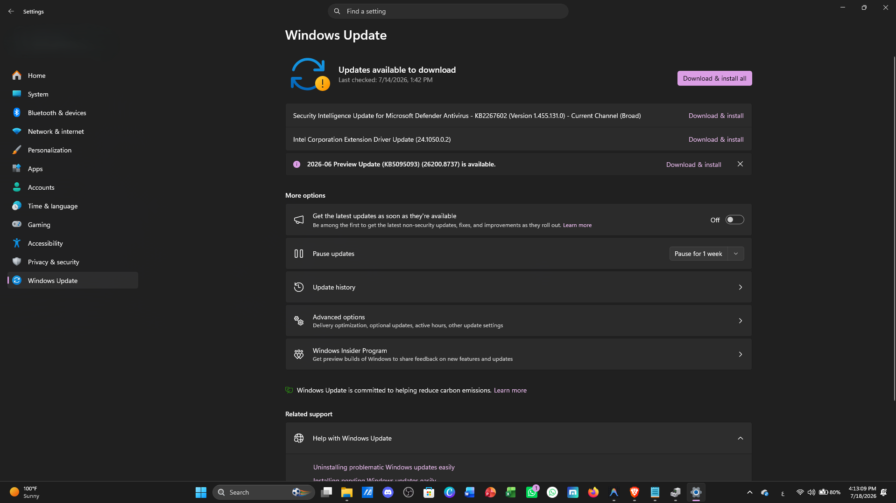

# Windows Update Errors Troubleshooting

## Overview

Windows Update errors can prevent important security patches, bug fixes, and feature updates from being installed. This guide explains how to diagnose and resolve common update issues.

---

## Symptoms

Users may experience:

- Windows Update fails to install
- Updates remain stuck at a percentage
- Error codes displayed during updates
- Repeated update failures
- Slow update process

---

## Possible Causes

- Corrupted update files
- Insufficient disk space
- Internet connectivity issues
- Damaged system files
- Windows Update service problems
- Antivirus interference

---

## Troubleshooting Methodology

### Step 1 – Check Internet Connection

Verify that the computer has a stable Internet connection.

---

### Step 2 – Restart the Computer

Restart Windows and check for updates again.

---

### Step 3 – Check Available Disk Space

Ensure the system drive has at least 20 GB of free space before installing major updates.

---

### Step 4 – Run Windows Update Troubleshooter

Go to:

```
Settings → System → Troubleshoot → Other Troubleshooters
```

Run:

```
Windows Update
```

---

### Step 5 – Restart Windows Update Services

Run Command Prompt as Administrator:

```cmd
net stop wuauserv
net stop bits

net start wuauserv
net start bits
```

---

### Step 6 – Repair System Files

Run:

```cmd
sfc /scannow
```

Then:

```cmd
DISM /Online /Cleanup-Image /RestoreHealth
```

---

### Step 7 – Check for Pending Updates

Open:

```
Settings → Windows Update
```

Install available updates and restart the computer if required.

---

## Windows Update Settings Overview

Windows Update Settings allow IT Support technicians to check update status, install available updates, review update history, and troubleshoot update-related issues.



---

## Useful Commands

```cmd
sfc /scannow
```

Repair Windows system files.

```cmd
DISM /Online /Cleanup-Image /RestoreHealth
```

Repair Windows image.

```cmd
net stop wuauserv
```

Stop Windows Update service.

```cmd
net start wuauserv
```

Start Windows Update service.

```cmd
net stop bits
```

Stop Background Intelligent Transfer Service.

```cmd
net start bits
```

Start Background Intelligent Transfer Service.

---

## Resolution

Most Windows Update issues can be resolved by:

- Running the Windows Update Troubleshooter
- Restarting Windows Update services
- Repairing system files
- Ensuring sufficient disk space
- Restarting the computer after updates

---

## Prevention

- Enable automatic updates.
- Keep sufficient free disk space.
- Restart the computer regularly.
- Install updates promptly.
- Avoid interrupting the update process.

---

## Related Issues

- Startup Problems
- Slow Computer
- Blue Screen (BSOD)